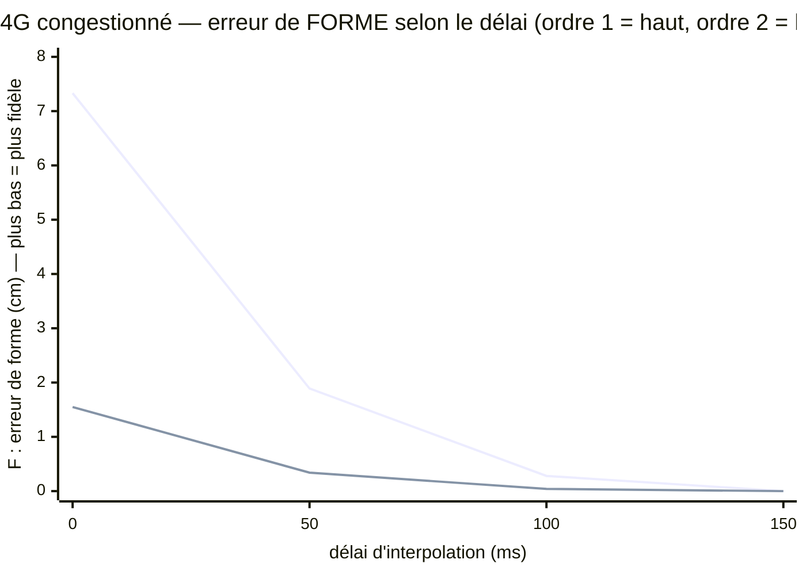
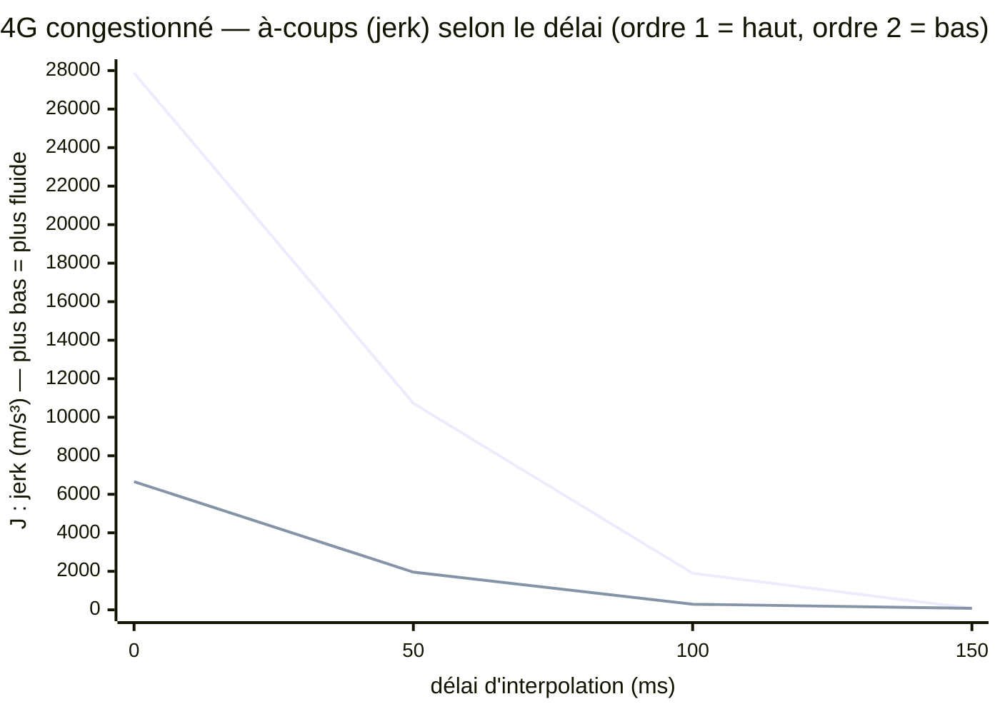

# Chantier « vivant » — mesurer si un mouvement perçu est vivant, par les maths

*[English version](en/chantier-vivant.md)*

> Un doute revient sans cesse dans ce projet : *« et si on avait bâti une forteresse vide ? »* — une technique
> solide, mais un monde qui ne donne pas l'impression d'être **habité**. C'est subjectif… alors on a essayé d'en
> faire une **mesure objective, déterministe, optimisable** : un banc qui compare ce qu'un personnage a *vraiment*
> fait à ce qu'un autre joueur *voit* après le réseau, et qui en tire un verdict chiffré « vivant / pas vivant ».
> Cette page montre le banc, un levier qu'on a trouvé, et **ce que ça ne prouve pas encore**.
>
> Voir : [le registre des doutes](doutes.md) (doute D27) · [l'état chiffré](etat-du-projet.md) · [les coulisses](coulisses.md).

---

## 1. Le problème : « vivant » est subjectif — on veut un chiffre

Quand un avatar distant bouge sur votre écran, sa position vous arrive par le réseau : en retard, par à-coups, avec
des trous (paquets perdus). Le moteur **comble** entre deux nouvelles : il interpole, il extrapole. S'il le fait
mal, le mouvement *pique* (saccades, téléports) ou *flotte* (tout est mou, en retard). Bien fait, on ne voit rien —
ça paraît vivant. Mais « ça paraît » n'est pas une mesure. Tant que c'est une impression, on ne peut pas l'optimiser.

**L'idée :** jouer une vraie trajectoire (qu'on connaît exactement, car elle est analytique), la faire passer par un
canal réseau réaliste, la reconstruire côté récepteur, puis **comparer les deux courbes** — la vérité et le perçu.

## 2. Trois mesures, séparées exprès

On refuse une note unique : « vivant » a trois composantes qui se règlent séparément.

| Mesure | Ce qu'elle capte | Objectif |
|---|---|---|
| **Fidélité de forme `F`** | l'erreur de tracé **une fois le retard compensé** — « est-ce le bon geste, juste en retard ? » | la plus petite possible (cm) |
| **Fraîcheur `d_eff`** | le retard effectivement perçu | ≤ 500 ms, **ambition ≈ 150 ms** |
| **Fluidité `J`** | le « jerk » (à-coups) + le nombre de téléports visibles | proche du mouvement naturel |

La philosophie est celle de tout le projet : *« 500 ms de retard mais fluide et exact = parfait ; des trous = mort. »*
Le verdict **vivant** exige les trois à la fois. Tout est simulé et déterministe (graine fixe) → rejouable à
n'importe quelle échelle, sans réseau réel : les vrais liens ne servent qu'à **calibrer** les profils injectés.

## 3. Le compromis, tracé et non deviné

Augmenter le délai d'interpolation rend le mouvement plus fidèle et plus fluide (on attend d'avoir les vraies
positions au lieu de les inventer), mais moins frais. Le banc **trace** cette frontière au lieu de la supposer. La
question « peut-on tenir 150 ms ? » devient une réponse chiffrée, par profil de lien — et on **balaie des leviers**
(cadence d'envoi, ordre de prédiction, lissage) pour la déplacer.

## 4. Un levier qui aide vraiment : prédire avec l'accélération (« ordre 2 »)

Le récepteur classique prolonge un avatar par sa **vitesse** (une droite — « ordre 1 »). Sur un virage, la droite
part à côté ; quand la vraie position arrive enfin, ça corrige d'un coup → saccade. On a essayé de prolonger en
tenant compte de l'**accélération** (une parabole — « ordre 2 »), l'accélération étant **estimée localement** à
partir des dernières vitesses reçues — *donc sans rien ajouter au format réseau.*

Le résultat, mesuré sur le cas le plus dur (mouvement vif, lien 4G congestionné), est net : l'ordre 2 **divise à la
fois l'erreur de forme et les à-coups par ~6×** à bas délai. Là où un simple lissage échangeait les saccades contre
du flou, l'ordre 2 améliore **les deux**.

**Et la combinaison débloque l'ambition.** Comme l'ordre 2 prédit déjà bien, ses corrections sont petites : un
lissage **léger** par-dessus ne « coupe » presque plus les virages. Ce couple atteint le verdict **vivant dès
≈ 100 ms de retard effectif sur le 4G congestionné** — le pire lien de notre flotte — là où la prédiction d'ordre 1
seule exigeait 150 ms. L'ambition des 150 ms n'est pas seulement atteinte, elle est battue d'environ 50 ms sur le
cas dur.

Au passage, le balayage de la cadence d'envoi a **réfuté une intuition** : envoyer plus souvent (30 Hz au lieu de
20) n'aide pas sur un lien à forte gigue — l'intervalle entre paquets devient comparable à la gigue, le
ré-ordonnancement augmente, et les à-coups remontent — pour 50 % d'octets reçus en plus. **20 Hz reste le bon
point** : c'est une décision confirmée par la mesure, pas par habitude.

## 5. Ce que ça prouve — et ce que ça ne prouve PAS

**Ce qui est acquis.** Une métrique objective et reproductible existe ; un modèle de référence de reconstruction est
codé et testé (un garde-fou vérifie qu'une ligne droite se reconstruit exactement, qu'une perte dégrade bien les
mesures, qu'une accélération constante est suivie par l'ordre 2 là où l'ordre 1 dévie). Le compromis fraîcheur ↔
fidélité ↔ fluidité est **tracé**, et un levier concret y gagne franchement.

**Ce qui reste, honnêtement.** Les profils de lien sont *inspirés* de nos mesures réelles, pas encore branchés en
direct sur la sonde — c'est la prochaine étape. Et surtout : ce banc mesure un **modèle de référence**, pas
l'expérience jouée. Le vrai test du doute D27 — *est-ce que ça donne envie d'y être ?* — demandera ce modèle
implémenté dans le moteur 3D, une vraie place sociale, et des gens dedans. Le banc ne remplace pas ce moment ; il
**enlève le hasard** de la marche qui y mène.

---

*🗺️ [Revenir à la vitrine](../README.md) · 📚 [Sommaire de la doc](README.md) · 📖 [Glossaire](glossaire.md)*
