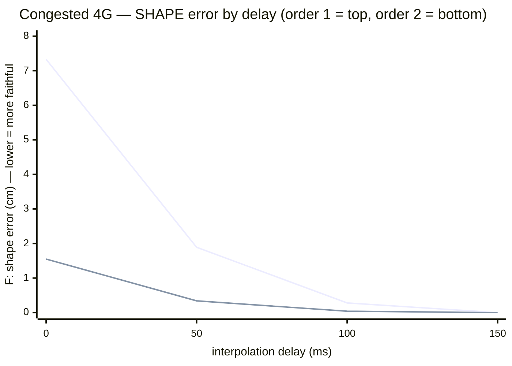
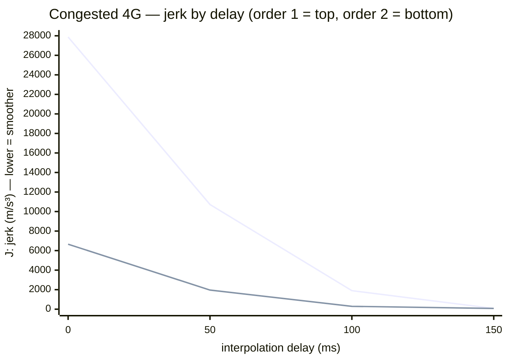

# "Alive" work — measuring whether perceived motion is alive, with maths

*[Version française](../chantier-vivant.md)*

> A doubt comes back again and again in this project: *"what if we had built an empty fortress?"* — a solid
> technique, but a world that does not feel **inhabited**. It is subjective… so we tried to turn it into an
> **objective, deterministic, optimisable measurement**: a bench that compares what a character *really* did
> to what another player *sees* after the network, and draws a numeric "alive / not alive" verdict. This page
> shows the bench, a lever we found, and **what it does not prove yet**.
>
> See: [the register of doubts](doutes.md) (doubt D27) · [the measured state](etat-du-projet.md) · [behind the scenes](coulisses.md).

---

## 1. The problem: "alive" is subjective — we want a figure

When a distant avatar moves on your screen, its position reaches you over the network: late, in jerks, with
holes (lost packets). The engine **fills in** between two updates: it interpolates, it extrapolates. If it
does it badly, the motion *spikes* (stutters, teleports) or *floats* (everything is mushy, late). Done well,
you see nothing — it looks alive. But "it looks" is not a measurement. As long as it is an impression, it
cannot be optimised.

**The idea:** play a real trajectory (which we know exactly, because it is analytic), send it through a
realistic network channel, reconstruct it on the receiver's side, then **compare the two curves** — the truth
and the perceived.

## 2. Three measures, deliberately separated

We refuse a single score: "alive" has three components that are tuned separately.

| Measure | What it captures | Target |
|---|---|---|
| **Shape fidelity `F`** | the tracing error **once the delay is compensated** — "is it the right gesture, just late?" | as small as possible (cm) |
| **Freshness `d_eff`** | the delay actually perceived | ≤ 500 ms, **ambition ≈ 150 ms** |
| **Smoothness `J`** | the "jerk" + the number of visible teleports | close to natural motion |

The philosophy is the whole project's: *"500 ms of delay but smooth and exact = perfect; holes = dead."* The
**alive** verdict requires all three at once. Everything is simulated and deterministic (fixed seed) →
replayable at any scale, with no real network: the real links only serve to **calibrate** the injected
profiles.

## 3. The trade-off, traced not guessed

Increasing the interpolation delay makes the motion more faithful and smoother (you wait to have the real
positions instead of inventing them), but less fresh. The bench **traces** this boundary instead of assuming
it. The question "can we hold 150 ms?" becomes a numeric answer, per link profile — and we **sweep levers**
(send rate, prediction order, smoothing) to move it.

## 4. A lever that really helps: predict with acceleration ("order 2")

The classic receiver extends an avatar by its **velocity** (a straight line — "order 1"). On a turn, the line
goes off; when the real position finally arrives, it corrects all at once → stutter. We tried to extend while
accounting for **acceleration** (a parabola — "order 2"), the acceleration being **estimated locally** from
the last velocities received — *so without adding anything to the network format.*

The result, measured on the hardest case (brisk motion, congested 4G link), is clear: order 2 **divides both
the shape error and the jerk by ~6×** at low delay. Where mere smoothing traded stutter for blur, order 2
improves **both**.

**And the combination unlocks the ambition.** Since order 2 already predicts well, its corrections are small:
a **light** smoothing on top almost no longer "cuts" the turns. This pair reaches the **alive** verdict from
as little as **≈ 100 ms of effective delay on congested 4G** — the worst link in our fleet — where order-1
prediction alone required 150 ms. The 150 ms ambition is not only met, it is beaten by about 50 ms on the hard
case.

Along the way, the send-rate sweep **refuted an intuition**: sending more often (30 Hz instead of 20) does not
help on a high-jitter link — the inter-packet interval becomes comparable to the jitter, reordering
increases, and jerk goes back up — for 50 % more bytes received. **20 Hz remains the sweet spot**: a decision
confirmed by measurement, not by habit.

## 5. What it proves — and what it does NOT prove

**What is acquired.** An objective, reproducible metric exists; a reference reconstruction model is coded and
tested (a guard checks that a straight line is reconstructed exactly, that a loss degrades the fidelity as
expected, that a constant acceleration is followed by order 2 where order 1 deviates). The fidelity ↔
freshness ↔ smoothness trade-off is **traced**, and a concrete lever gains from it markedly.

**What remains, honestly.** The link profiles are *inspired* by our real measurements, not yet wired live to
the probe — that is the next step. And above all: this bench measures a **reference model**, not the played
experience. The real test of doubt D27 — *does it make you want to be there?* — will require this model
implemented in the 3D engine, a real social place, and people in it. The bench does not replace that moment;
it **removes the randomness** of the walk that leads to it.

---

*🗺️ [Back to the showcase](../../README.en.md) · 📚 [Documentation index](README.md) · 📖 [Glossary](glossaire.md)*
